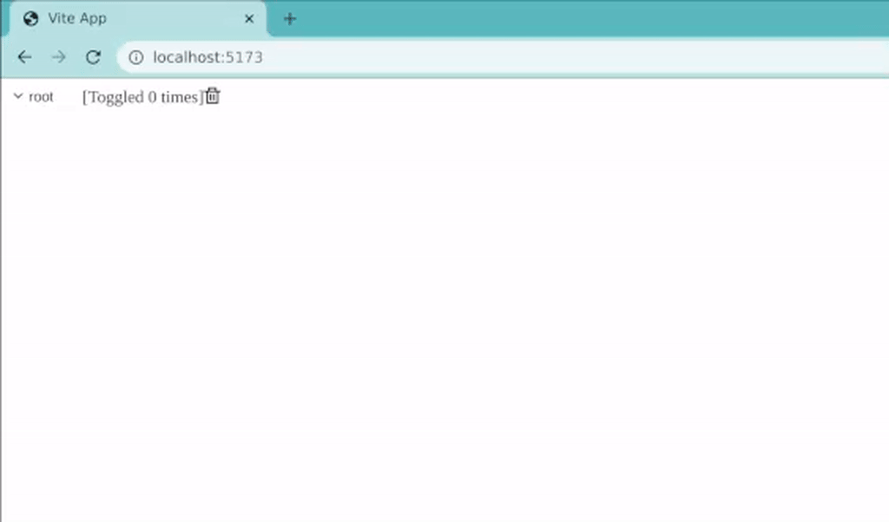

## scalajs + vite project

### Usage

This is a scalajs and vite project. start `sbt` and run `~fastLinkJS` and keep it open. In another terminal do `npm install` and then `npm run dev`. It should tell you where to open the browser.

Here is an example of a small tree view in which the normally ephemeral state of the tree survives reloads:

